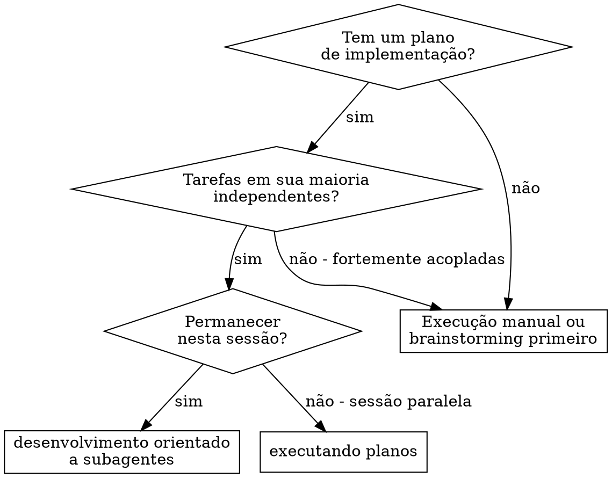
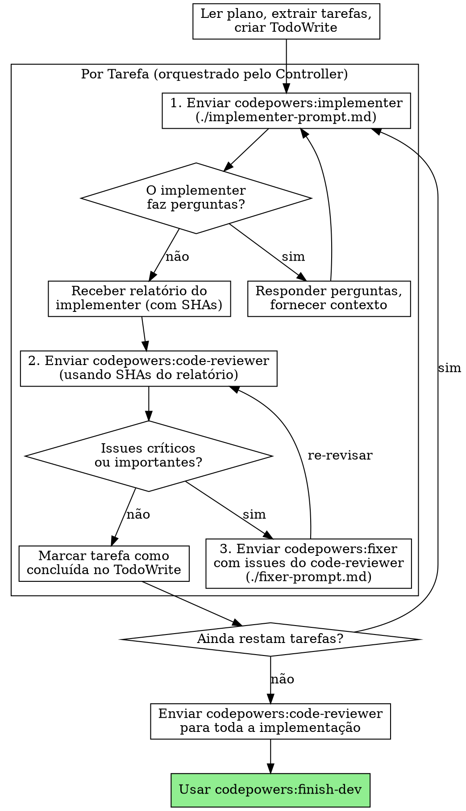

# Desenvolvimento Orientado a Subagentes

Execute o plano enviando o subagente `codepowers:implementer` para cada tarefa. O controller orquestra o ciclo: despacha o implementer, recebe o relatório, despacha o `codepowers:code-reviewer` para revisão, e despacha o `codepowers:fixer` para correções se necessário.

**Princípio fundamental:** Implementer focado + revisão orquestrada pelo controller = alta qualidade, separação clara de responsabilidades

## Quando usar



**vs. Executando Planos (sessão paralela):**
- Mesma sessão (sem troca de contexto)
- Subagente implementer novo por tarefa (sem poluição de contexto)
- Revisão de código orquestrada pelo controller após cada tarefa
- Iteração mais rápida (sem intervenção humana entre as tarefas)

## O Processo



## Modelos de Prompt

- `./implementer-prompt.md` - Acionar o subagente `codepowers:implementer`
- `./fixer-prompt.md` - Acionar o subagente `codepowers:fixer` para correções

## Exemplo de Fluxo de Trabalho

``` Você: Estou usando Desenvolvimento Orientado a Subagentes para executar este plano.

[Ler o arquivo do plano uma vez: docs/plans/feature-plan.md]
[Extrair todas as 5 tarefas com texto completo e contexto]
[Criar um TodoWrite com todas as tarefas]

Tarefa 1: Script de instalação do hook

[Obter o texto e o contexto da Tarefa 1 (já extraídos)]
[Acionar codepowers:implementer com o texto completo da tarefa + contexto]

Implementer: "Antes de começar, o hook deve ser instalado no nível do usuário ou do sistema?"

Você: "Nível de usuário (~/.config/codepowers/hooks/)"

Implementer: "Entendi. Implementando agora..."
[Implementa, commita, autoavalia]
Implementer reporta:
- Implementou o comando install-hook
- Autoavaliação: Percebi que esqueci a flag --force, adicionei-a
- SHA base: abc1234
- SHA HEAD: def5678
- Arquivos alterados: src/hooks/install.ts, tests/hooks/install.test.ts

[Controller despacha codepowers:code-reviewer com SHAs abc1234..def5678]
Code-reviewer: ✅ Aprovado

[Marcar Tarefa 1 como concluída]

Tarefa 2: Modos de recuperação

[Obter texto e contexto da Tarefa 2 (já extraídos)]
[Enviar codepowers:implementer com texto completo da tarefa + contexto]

Implementer: [Sem perguntas, prosseguir]
[Implementa, commita, autoavalia]
Implementer reporta:
- Adicionados modos de verificação/reparo
- SHA base: def5678
- SHA HEAD: ghi9012
- Arquivos alterados: src/recovery.ts, tests/recovery.test.ts

[Controller despacha codepowers:code-reviewer com SHAs def5678..ghi9012]
Code-reviewer: ❌ 1 issue importante encontrado

[Controller despacha codepowers:fixer com issues do code-reviewer]
Fixer corrige, commita, reporta:
- SHA base: ghi9012
- SHA HEAD: jkl3456

[Controller despacha codepowers:code-reviewer com SHAs ghi9012..jkl3456]
Code-reviewer: ✅ Aprovado

[Marcar Tarefa 2 como concluída]

...

[Após todas as tarefas]
[Enviar codepowers:code-reviewer para revisão final de toda a implementação]
Revisor final: Todos os requisitos atendidos, pronto para mesclar

Concluído!

```

## Vantagens

**em comparação com a execução manual:**
- Contexto novo para cada tarefa (sem confusão)
- Segurança para execução paralela (os subagentes não interferem uns nos outros)
- O subagente pode fazer perguntas (antes E durante o trabalho)

**em comparação com a Execução de Planos:**
- Mesma sessão (sem transferência de responsabilidade)
- Progresso contínuo (sem espera)
- Revisão de código automática por tarefa (orquestrada pelo controller)

**Ganhos de eficiência:**
- Sem sobrecarga de leitura de arquivos (o controlador fornece o texto completo)
- O controlador seleciona exatamente o contexto necessário
- O subagente recebe informações completas antecipadamente
- Dúvidas surgem antes do início do trabalho (não depois)
- Controller orquestra revisão com SHAs exatos (sem ambiguidade sobre o que revisar)

**Controles de qualidade:**
- A autoavaliação detecta problemas antes da revisão
- O controller despacha o code-reviewer após cada tarefa (revisão garantida)
- Ciclos de correção orquestrados pelo controller (implementer foca, reviewer revisa)
- Revisão final de toda a implementação antes de concluir

**Custo:**
- Implementer + code-reviewer por tarefa (orquestrados pelo controller)
- Fixer + code-reviewer adicionais quando há issues (ciclos de correção)
- Mas detecta problemas precocemente (mais barato do que depurar posteriormente)

## Sinais de alerta

**Nunca:**
- Iniciar a implementação em branch principal/master sem consentimento explícito do usuário
- Prosseguir com problemas não corrigidos
- Despachar vários subagentes de implementação em paralelo (conflitos)
- Fazer o subagente ler o arquivo de plano (fornecer o texto completo)
- Ignorar o contexto de ambientação (o subagente precisa entender onde a tarefa se encaixa)
- Ignorar as perguntas do subagente (responder antes de permitir que ele prossiga)
- Passar para a próxima tarefa sem aguardar o relatório do implementer e a revisão do code-reviewer

**Se o subagente fizer perguntas:**
- Responder de forma clara e completa
- Fornecer contexto adicional, se necessário
- Não apressá-lo na implementação

**Se o subagente falhar na tarefa:**
- Envie um subagente de correção com instruções específicas
- Não tente corrigir manualmente (poluição de contexto)

## Integração

**Habilidades de fluxo de trabalho necessárias:**
- **codepowers:request-code-review** - Modelo de revisão de código (usado pela revisão final)
- **codepowers:finish-dev** - Finalizar o desenvolvimento após conclusão de todas as tarefas

**Fluxo de trabalho alternativo:**
- **codepowers:execute-plan** - Use para sessão paralela em vez de sessão única execução
