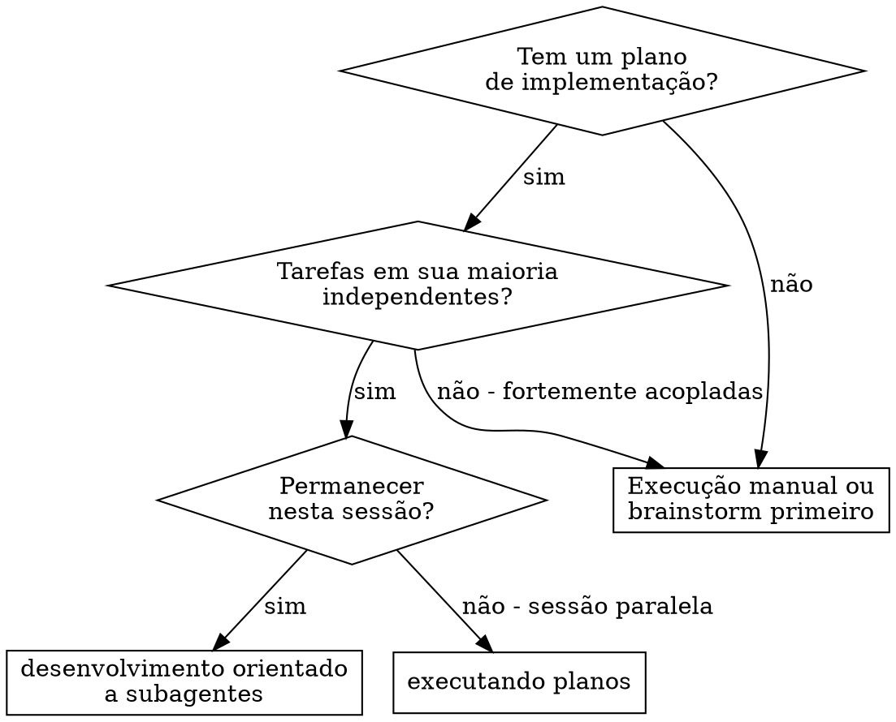
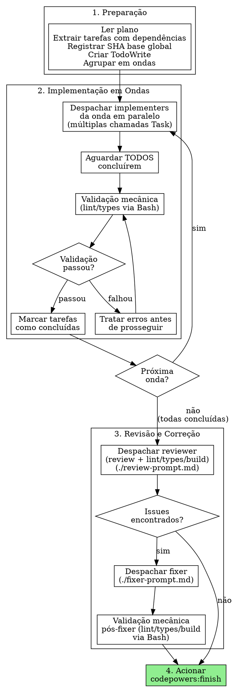

# Desenvolvimento Orientado a Subagentes

Execute o plano despachando subagentes `codepowers:implementer` em ondas paralelas para cada grupo de tarefas independentes. Após todas as tarefas concluídas, o controller despacha um único `codepowers:reviewer` para revisão de código com checagem técnica, e `codepowers:fixer` para correções se necessário.

**Princípio fundamental:** Implementers focados em ondas paralelas + revisão única centralizada = alta qualidade com economia de tokens

## Quando usar



**vs. Executando Planos (sessão paralela):**
- Mesma sessão (sem troca de contexto)
- Implementers paralelos por onda (velocidade)
- Revisão e checagem únicas após todas as tarefas (economia de tokens)
- Sem intervenção humana entre as tarefas

## O Processo



## Regras de Agrupamento em Ondas

O controller agrupa tarefas em ondas usando o campo `Depende de:` de cada tarefa no plano:

1. Tarefas com `Depende de: Nenhuma` → **Onda 1**
2. Tarefas que dependem apenas de tarefas já concluídas → **próxima onda**
3. Dentro de uma onda: despachar **TODOS** os implementers simultaneamente (múltiplas chamadas Task na mesma mensagem)
4. Se uma onda tem apenas 1 tarefa, despachar normalmente

**Exemplo de agrupamento:**
- Tarefa 1: Nenhuma, Tarefa 2: Nenhuma, Tarefa 3: Tarefa 1, Tarefa 4: Nenhuma, Tarefa 5: Tarefa 3, Tarefa 4
- Onda 1: Tarefas 1, 2, 4 (paralelo) → Onda 2: Tarefa 3 → Onda 3: Tarefa 5

## Validação Mecânica Entre Ondas

Após todos os implementers de uma onda retornarem, o controller executa **diretamente via Bash** (sem subagente):

1. Detectar o ecossistema do projeto (package.json, Cargo.toml, etc.)
2. Executar: lint → types (sem build — build é feito na revisão final)

**Se falhar:**
- Analisar os erros (são da onda atual ou pré-existentes?)
- Se da onda atual: re-despachar implementer com instruções de correção específicas
- Se pré-existentes: registrar e prosseguir

**Se passar:** Marcar tarefas como concluídas, prosseguir para próxima onda.

## Modelos de Prompt

- `./implementer-prompt.md` — Despachar o subagente `codepowers:implementer`
- `./review-prompt.md` — Despachar o subagente `codepowers:reviewer` (com checagem técnica + review particionado)
- `./fixer-prompt.md` — Despachar o subagente `codepowers:fixer`

## Exemplo de Fluxo de Trabalho

```
Você: Estou usando Desenvolvimento Orientado a Subagentes para executar este plano.

[Ler o arquivo do plano uma vez: docs/plans/feature-plan.md]
[Extrair todas as 5 tarefas com texto completo, contexto e dependências]
[Registrar SHA base global: abc1234]
[Criar um TodoWrite com todas as tarefas]
[Agrupar em ondas: Onda 1 (T1, T2, T4), Onda 2 (T3), Onda 3 (T5)]

--- Onda 1: Tarefas 1, 2 e 4 (paralelo) ---

[Despachar 3 implementers simultaneamente via múltiplas chamadas Task]

Implementer T1 reporta:
- SHA base: abc1234, SHA HEAD: def5678
- Arquivos: src/auth.ts, src/auth.test.ts
- Resumo: Implementado módulo de autenticação com JWT

Implementer T2 reporta:
- SHA base: abc1234, SHA HEAD: ghi9012
- Arquivos: src/api.ts
- Resumo: Implementado endpoint de listagem de usuários

Implementer T4 reporta:
- SHA base: abc1234, SHA HEAD: jkl3456
- Arquivos: src/utils.ts
- Resumo: Implementado utilitário de validação de datas

[Validação mecânica via Bash: lint ✓ types ✓]
[Marcar T1, T2, T4 como concluídas]

--- Onda 2: Tarefa 3 (depende de T1) ---

[Despachar 1 implementer]

Implementer T3 reporta:
- SHA base: jkl3456, SHA HEAD: mno7890
- Arquivos: src/middleware.ts
- Resumo: Implementado middleware de autorização usando módulo auth

[Validação mecânica via Bash: lint ✓ types ✓]
[Marcar T3 como concluída]

--- Onda 3: Tarefa 5 (depende de T3 e T4) ---

[Despachar 1 implementer]

Implementer T5 reporta:
- SHA base: mno7890, SHA HEAD: pqr1234
- Arquivos: src/routes.ts
- Resumo: Implementado rotas protegidas com middleware e validação

[Validação mecânica via Bash: lint ✓ types ✓]
[Marcar T5 como concluída]

--- Todas as tarefas concluídas ---

[Despachar codepowers:reviewer com:]
- SHA base global: abc1234, SHA HEAD final: pqr1234
- Diffs por tarefa: T1(abc..def), T2(abc..ghi), T3(jkl..mno), T4(abc..jkl), T5(mno..pqr)
- Checagem técnica + review particionado + revisão de integração

Code-reviewer reporta:
- Lint ✓, Types ✓, Build ✓
- 1 issue importante: src/middleware.ts:42 — tratamento de erro ausente
- Avaliação: Com correções

[Despachar codepowers:fixer com issues do reviewer]

Fixer reporta:
- SHA base: pqr1234, SHA HEAD: stu5678
- Issues corrigidos: adicionado tratamento de erro no middleware

[Validação mecânica pós-fixer via Bash: lint ✓ types ✓ build ✓]

[Acionar codepowers:finish]
Concluído!
```

## Sinais de Alerta

**Nunca:**
- Fazer o implementer rodar lint, types, build ou review
- Despachar o reviewer antes de TODAS as tarefas estarem concluídas
- Despachar implementers de ondas diferentes em paralelo
- Fazer o subagente ler o arquivo de plano (fornecer o texto completo)
- Prosseguir para a próxima onda se a validação mecânica falhou
- Ignorar as perguntas do subagente (responder antes de permitir que ele prossiga)

**Sempre:**
- Aguardar TODOS os implementers de uma onda antes da validação mecânica
- Executar validação mecânica entre ondas (lint/types via Bash)
- Fornecer texto completo + contexto ao implementer (não fazê-lo ler o arquivo de plano)
- Registrar o SHA base global antes da primeira onda
- Executar validação mecânica após o fixer (lint/types/build via Bash)

**Se o implementer fizer perguntas:**
- Responder de forma clara e completa
- Fornecer contexto adicional, se necessário
- Retomar o implementer com as respostas (via resume do subagente)

**Se a validação mecânica entre ondas falhar:**
- Analisar os erros (são da onda atual ou pré-existentes?)
- Se da onda atual: re-despachar implementer com instruções de correção
- Se pré-existentes: registrar e prosseguir

**Se o implementer falhar na tarefa:**
- Re-despachar um novo implementer com instruções de correção específicas
- Não tente corrigir manualmente (poluição de contexto)

## Vantagens

**vs. execução manual:**
- Contexto novo para cada tarefa (sem confusão)
- Implementers paralelos por onda (velocidade)
- Segurança para execução paralela (tarefas independentes não interferem)

**vs. Execução de Planos (sessão paralela):**
- Mesma sessão (sem transferência de responsabilidade)
- Progresso contínuo (sem espera)
- Revisão de código automática (orquestrada pelo controller)

**Economia de tokens:**
- Implementers sem lint/types/build (eliminado N execuções por plano)
- Relatório compacto (sem autoavaliação extensa)
- Review único em vez de N reviews por tarefa
- Validação mecânica via Bash (sem subagentes extras)
- Fixer sem re-review (validação mecânica substitui)

**Qualidade preservada:**
- Validação mecânica entre ondas detecta erros estruturais cedo
- Review particionado por tarefa mantém foco e qualidade da análise
- Revisão de integração garante coesão entre tarefas
- Validação mecânica pós-fixer garante que correções não quebram nada

## Integração

**Skills de fluxo de trabalho necessárias:**
- **codepowers:review** — Disponível para revisões ad-hoc (não usa checagem técnica)
- **codepowers:finish** — Finalizar o desenvolvimento após conclusão de todas as fases

