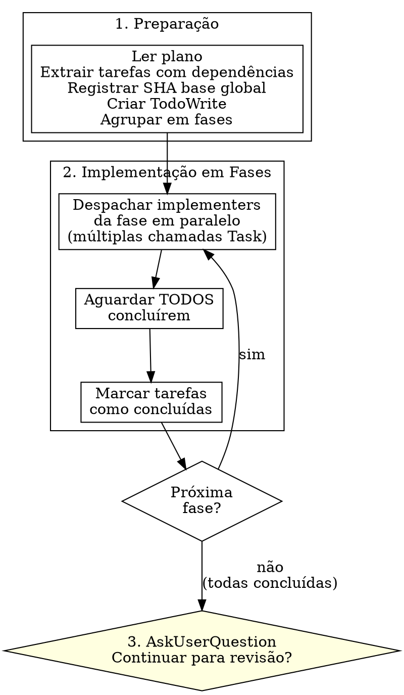

Execute o plano despachando subagentes `codepowers:implementer` em fases paralelas, agrupadas por dependências. Após todas as tarefas concluídas, devolve o controle ao usuário para decidir se deseja prosseguir para revisão.

**Princípio fundamental**: Um bom plano é tão claro e detalhado que pode ser executado por um agente sem contexto adicional. A skill `execute` é responsável por seguir esse plano de forma estruturada, garantindo que as tarefas sejam concluídas corretamente.
**Anunciar no início:** "Estou usando a skill `execute` para executar um plano de implementação. Vou seguir um processo estruturado para garantir que as tarefas sejam concluídas corretamente."

## O Processo

## Preparação

1. Ler o arquivo do plano uma única vez
2. Extrair todas as tarefas com texto completo, contexto e dependências
3. Registrar SHA base global: `git rev-parse HEAD`
4. Criar TodoWrite com todas as tarefas
5. Agrupar tarefas em fases usando o campo `Depende de:`

## Agrupamento em Fases

O campo `Depende de:` de cada tarefa no plano determina o agrupamento:

1. Tarefas com `Depende de: Nenhuma` → **Fase 1**
2. Tarefas que dependem apenas de tarefas já concluídas → **próxima fase**
3. Dentro de uma fase: despachar **TODOS** os implementers simultaneamente (múltiplas chamadas Task na mesma mensagem)
4. Se uma fase tem apenas 1 tarefa, despachar normalmente

**Exemplo:**
- Tarefa 1: Nenhuma, Tarefa 2: Nenhuma, Tarefa 3: Tarefa 1, Tarefa 4: Nenhuma, Tarefa 5: Tarefa 3, Tarefa 4
- Fase 1: Tarefas 1, 2, 4 (paralelo) → Fase 2: Tarefa 3 → Fase 3: Tarefa 5

## Implementação por Fase

Para cada fase, na ordem:

1. Despachar implementers usando `./implementer-prompt.md` — fornecer texto completo da tarefa + contexto (nunca fazer o subagente ler o arquivo de plano)
2. Aguardar **TODOS** os implementers da fase concluírem
3. Marcar tarefas como concluídas, prosseguir para próxima fase

## Templates de Prompt

- `./implementer-prompt.md` — Despachar `codepowers:implementer`

## Regras

**Nunca:**
- Fazer o implementer rodar lint, types, build ou review
- Despachar implementers de fases diferentes em paralelo
- Fazer o subagente ler o arquivo de plano (fornecer o texto completo)

**Sempre:**
- Aguardar TODOS os implementers de uma fase antes de prosseguir
- Fornecer texto completo + contexto ao implementer
- Registrar o SHA base global antes da primeira fase

**Se o implementer fizer perguntas:**
- Responder de forma clara e completa
- Retomar o implementer com as respostas (via resume do subagente)

**Se o implementer falhar:**
- Re-despachar um novo implementer com instruções de correção específicas
- Não corrigir manualmente (poluição de contexto)

## Transferência

Após todas as tarefas concluídas, use `AskUserQuestion` para perguntar se deseja revisar:

- **Pergunta:** "Implementação concluída. Deseja continuar para revisão?"
- **Opção 1:** "Continuar para revisão" — descrição: "Revisão de código + checagem técnica (lint/types/build) + correções se necessário"
- **Opção 2:** "Parar por aqui" — descrição: "Encerrar sem revisão"

**Se continuar for escolhido:**

- Usar skill `codepowers:review` para revisão estruturada do código
