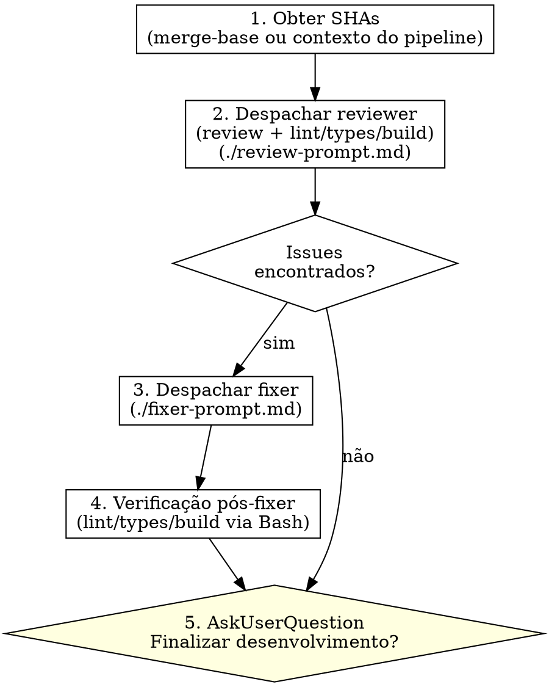

# Revisão de Código

Acione o subagente `codepowers:reviewer` para detectar problemas antes que se alastrem. Pode ser usado a qualquer momento — como etapa do pipeline após `/execute` ou de forma independente.

**Princípio fundamental:** A revisão de código é um passo crítico para garantir a qualidade do software. A skill `review` é responsável por orquestrar revisão + checagem técnica + correções, devolvendo o controle ao usuário ao final.
**Anunciar no início:** "Estou usando a skill `review` para solicitar uma revisão de código."

## O Processo



## 1. Obter SHAs

```bash
SHA_BASE=$(git merge-base HEAD origin/main) # ou SHA base global do pipeline
SHA_HEAD=$(git rev-parse HEAD)
```

- **Vindo do pipeline (`/execute`):** usar o SHA base global registrado pelo execute
- **Uso ad-hoc:** usar `git merge-base HEAD origin/main`

## 2. Despachar Reviewer

Preencha o template em `./reviewer-prompt.md` e despache `codepowers:reviewer`:

- **Vindo do pipeline:** preencher per-task diffs com SHAs dos implementers
- **Uso ad-hoc:** usar diff único com merge-base, sem breakdown por tarefa

O reviewer executa: checagem técnica (lint → tipos → build) + revisão de código + revisão de integração.

## 3. Correção (se necessário)

Se o reviewer encontrar issues:

1. Despachar `codepowers:fixer` usando `./fixer-prompt.md` com a lista completa de issues
2. Verificação pós-fixer via Bash: lint → types → build

## Templates de Prompt

- `./reviewer-prompt.md` — Despachar `codepowers:reviewer`
- `./fixer-prompt.md` — Despachar `codepowers:fixer`

## Regras

**Nunca:**
- Ignorar problemas críticos
- Prosseguir com problemas importantes não corrigidos
- Despachar o fixer sem issues do reviewer

**Sempre:**
- Executar checagem técnica (lint/types/build) no reviewer
- Verificar após o fixer (lint/types/build via Bash)
- Fornecer lista completa de issues ao fixer (incluindo checagem técnica)

**Se o revisor estiver errado:**
- Contestar com argumentos técnicos
- Mostrar código/testes que comprovem o funcionamento

## Transferência

Após a revisão (com ou sem correções), use `AskUserQuestion` para perguntar se deseja finalizar:

- **Pergunta:** "Revisão concluída. Deseja finalizar o desenvolvimento?"
- **Opção 1:** "Finalizar" — descrição: "Testes → checagem → push → PR"
- **Opção 2:** "Parar por aqui" — descrição: "Encerrar sem finalizar"

**Se finalizar for escolhido:**

- Usar skill `codepowers:finish` para finalização estruturada
